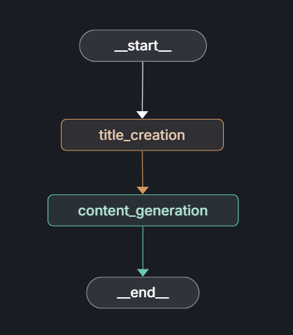
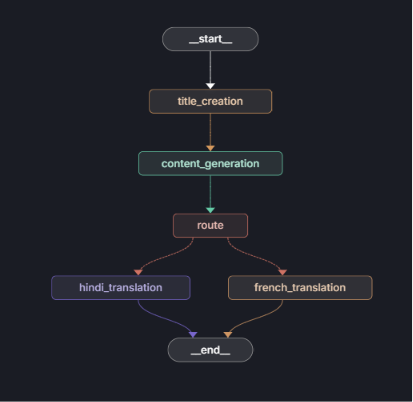

# Blog Generator with LangGraph

A powerful blog generation and translation system built with LangGraph, LangChain, and FastAPI. This project uses AI to generate creative blog titles and content, with support for multi-language translation.

## 📋 Table of Contents
- [Overview](#overview)
- [Features](#features)
- [Tech Stack](#tech-stack)
- [Project Structure](#project-structure)
- [Installation](#installation)
- [Usage](#usage)
- [API Endpoints](#api-endpoints)
- [Examples](#examples)
- [Architecture](#architecture)

## 🎯 Overview

Blog Generator is an intelligent application that leverages large language models (LLMs) to:
- Generate SEO-friendly blog titles based on topics
- Create detailed, well-structured blog content
- Translate blogs into multiple languages while preserving tone and formatting

The system uses **LangGraph** to orchestrate multi-step workflows and **FastAPI** to expose REST endpoints.

## ✨ Features

- **Title Generation**: Creates creative, SEO-friendly blog titles
- **Content Generation**: Generates comprehensive blog content with markdown formatting
- **Multi-language Support**: Translate blogs to:
  - Hindi (हिंदी)
  - French (Français)
  - Extensible for more languages
- **Structured Workflows**: LangGraph-based state machines for reliable execution
- **REST API**: FastAPI endpoints for easy integration
- **Stateful Processing**: Maintains blog state throughout the generation pipeline

## 🛠️ Tech Stack

- **LangGraph**: Orchestration and state management
- **LangChain**: LLM interactions and message handling
- **Groq API**: Fast LLM inference (llama-3.1-8b-instant)
- **FastAPI**: REST API framework
- **Uvicorn**: ASGI server
- **Pydantic**: Data validation and serialization

## 📁 Project Structure

```
Blog-Generator/
├── app.py                          # FastAPI application
├── main.py                         # Entry point
├── requirements.txt                # Project dependencies
├── pyproject.toml                  # Project metadata
├── langgraph.json                  # LangGraph configuration
└── src/
    ├── __init__.py
    ├── graphs/
    │   ├── __init__.py
    │   └── graph_builder.py        # LangGraph workflow definitions
    ├── nodes/
    │   └── blog_node.py            # Blog processing nodes
    └── states/
        └── blogstate.py            # State definitions
```

## 🚀 Installation

### Prerequisites
- Python 3.10+
- Groq API key
- LangChain API key

### Setup Steps

1. **Clone the repository**
   ```bash
   cd Blog-Generator
   ```

2. **Create virtual environment**
   ```bash
   python -m venv .venv
   .venv\Scripts\activate  # Windows
   source .venv/bin/activate  # macOS/Linux
   ```

3. **Install dependencies**
   ```bash
   pip install -r requirements.txt
   ```

4. **Configure environment variables**
   Create a `.env` file in the project root:
   ```
   GROQ_API_KEY=your_groq_api_key_here
   LANGCHAIN_API_KEY=your_langchain_api_key_here
   ```

5. **Run the application**
   ```bash
   uvicorn app:app --reload
   ```
   The API will be available at `http://localhost:8000`

## 📖 Usage

### Generate Blog (Topic Only)
Create a blog post with only the topic specified:

```bash
curl -X POST "http://localhost:8000/blogs" \
  -H "Content-Type: application/json" \
  -d '{
    "topic": "Agentic AI"
  }'
```

### Generate & Translate Blog
Generate a blog and translate it to a specific language:

```bash
curl -X POST "http://localhost:8000/blogs" \
  -H "Content-Type: application/json" \
  -d '{
    "topic": "Agentic AI",
    "language": "hindi"
  }'
```

## 🔌 API Endpoints

### POST `/blogs`
Generate blog content with optional translation.

**Request Body:**
```json
{
  "topic": "string (required) - The blog topic",
  "language": "string (optional) - Target language: 'hindi', 'french', etc."
}
```

**Response:**
```json
{
  "data": {
    "topic": "Agentic AI",
    "blog": {
      "title": "Generated blog title",
      "content": "Generated blog content in markdown format"
    },
    "current_language": "hindi (if translated)"
  }
}
```

### GET `/`
Health check endpoint.

**Response:**
```json
{
  "message": "Hello World"
}
```

## 💡 Examples

### Example 1: Simple Blog Generation

**Request:**
```json
{
  "topic": "Machine Learning Fundamentals"
}
```

**Response:**
```json
{
  "data": {
    "topic": "Machine Learning Fundamentals",
    "blog": {
      "title": "Mastering the Basics: A Comprehensive Guide to Machine Learning",
      "content": "# Machine Learning Fundamentals\n\n## Introduction\nMachine learning is a subset of artificial intelligence...",
      "current_language": "english"
    }
  }
}
```

### Example 2: Blog with Hindi Translation

**Request:**
```json
{
  "topic": "Artificial Intelligence Ethics",
  "language": "hindi"
}
```

**Response:** (Content translated to Hindi)
```json
{
  "data": {
    "topic": "Artificial Intelligence Ethics",
    "blog": {
      "title": "कृत्रिम बुद्धिमत्ता नैतिकता: एक व्यापक दृष्टिकोण",
      "content": "# कृत्रिम बुद्धिमत्ता नैतिकता\n\n## परिचय\nजैसे-जैसे AI तेजी से विकसित हो रहा है...",
      "current_language": "hindi"
    }
  }
}
```

## 🏗️ Architecture

### Workflow Diagram



This diagram shows the complete workflow:
1. **Input Processing**: Topic and optional language parameters
2. **Title Creation**: Generate SEO-friendly title
3. **Content Generation**: Create detailed content
4. **Translation** (Optional): Translate to target language
5. **Output**: Return formatted blog

### State Management



The system uses LangGraph's StateGraph to manage:
- Blog content (title + content)
- Current topic
- Target language for translation
- Routing decisions for multi-language support

### Node Breakdown

| Node | Purpose |
|------|---------|
| `title_creation` | Generate creative blog title |
| `content_generation` | Generate comprehensive blog content |
| `translation` | Translate blog to target language |
| `route_decision` | Route to appropriate translation node |

## 🔄 Workflow Steps

1. **Input Validation**: Check for topic and optional language
2. **Title Generation**: LLM generates SEO-friendly title
3. **Content Generation**: LLM creates detailed markdown content
4. **Conditional Translation**: If language specified, translate both title and content
5. **Output Formatting**: Return structured blog response

## 📝 Content Specifications

### Title
- Creative and SEO-friendly
- Single sentence
- Concise and engaging

### Content
- Markdown formatted
- Detailed breakdown of topic
- Well-structured sections
- Professional tone

### Translation
- Maintains original tone and formatting
- Culturally adapted idioms
- Preserves markdown structure
- Language-specific formatting

## 🐛 Troubleshooting

### Issue: "GROQ_API_KEY not found"
**Solution**: Ensure `.env` file is created with your Groq API key

### Issue: "Failed to call a function"
**Solution**: Verify the LLM response format matches the Blog schema (title + content required)

### Issue: "Node already present"
**Solution**: Graph is automatically recreated for each request; restart the server

## 📚 Dependencies

See `requirements.txt` for complete list:
- langchain
- langgraph
- langchain_community
- langchain_core
- langchain_groq
- fastapi
- uvicorn
- watchdog
- langgraph-cli

## 🤝 Contributing

To extend this project:
1. Add new languages in `route_decision()` method
2. Create new translation nodes for custom workflows
3. Extend the Blog model for additional fields
